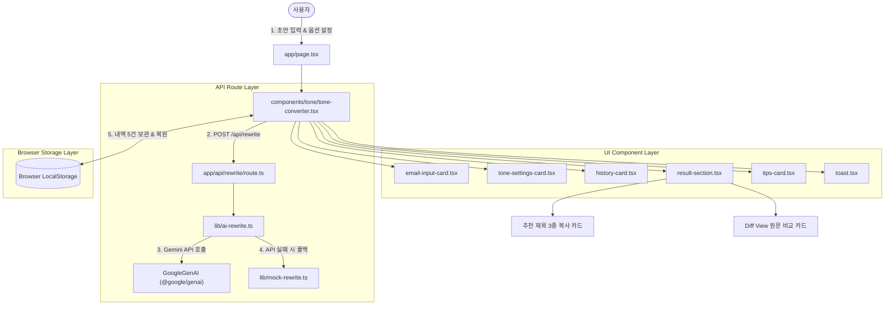

# System Architecture & Technical Specifications

## AI 이메일 말투·문법 다듬기 서비스 (`Email_changer` v2.0)

---

# 1. 시스템 아키텍처 (Architecture Diagram)



---

# 2. 프로젝트 디렉터리 구성

```
c:\Email_changer
├── app/
│   ├── api/
│   │   └── rewrite/
│   │       └── route.ts       # [NEW] Next.js POST API Route (Gemini AI 연동)
│   ├── globals.css            # 글로벌 Tailwind v4 스타일 및 디자인 변수
│   ├── layout.tsx             # Root Layout
│   └── page.tsx               # 메인 랜딩 페이지
├── components/
│   ├── tone/
│   │   ├── app-header.tsx         # 상단 로고 및 헤더
│   │   ├── email-input-card.tsx   # 이메일 초안 입력 카드
│   │   ├── history-card.tsx       # [NEW] 최근 다듬기 내역 5건 저장/복원 카드
│   │   ├── result-section.tsx     # [UPDATED] 다듬은 글, 추천 제목 3종 & Diff View
│   │   ├── tips-card.tsx          # 이메일 작성 팁 카드
│   │   ├── toast.tsx              # 토스트 피드백 알림
│   │   └── tone-settings-card.tsx # 어투 설정 카드 (8종 대상/목적 + 슬라이더)
│   └── ui/                    # UI 원시 컴포넌트 (Button, Card, Select 등)
├── lib/
│   ├── ai-rewrite.ts          # [NEW] Google Gen AI SDK 호출 및 폴백 로직
│   ├── mock-rewrite.ts        # 오프라인 규칙 기반 변환 엔진
│   ├── tone-options.ts        # 대상/목적 데이터 정의
│   └── utils.ts               # Classname 유틸리티
├── Docs/                      # 프로젝트 문서 (PRD, ARCHITECTURE, USER_GUIDE)
├── .env.local                 # GEMINI_API_KEY 환경변수 설정
├── package.json               # 의존성 및 스크립트 정의
└── tsconfig.json              # TypeScript 설정
```

---

# 3. 주요 모듈 및 API 설계

### 1) POST `/api/rewrite` ([app/api/rewrite/route.ts](file:///c:/Email_changer/app/api/rewrite/route.ts))
* **역할**: 클라이언트 요청을 받아 `requestAIRewrite`를 호출하고 결과를 반환합니다.
* **입력 매개변수**:
  ```json
  {
    "email": "이메일 초안 본문",
    "recipient": "교수님",
    "purpose": "요청",
    "toneLevel": 70
  }
  ```
* **출력 데이터**:
  ```json
  {
    "rewritten": "다듬어진 이메일 본문",
    "subjectLines": [
      "[교수님] 요청 관련 문의 드립니다",
      "안녕하세요 교수님, 요청 건으로 연락드립니다",
      "요청 건 관련하여 확인 부탁드립니다"
    ],
    "source": "ai"
  }
  ```

### 2) AI 엔진 연동 ([lib/ai-rewrite.ts](file:///c:/Email_changer/lib/ai-rewrite.ts))
* Google `@google/genai` SDK의 `gemini-2.5-flash` 모델 이용.
* `responseMimeType: 'application/json'` 응답 모드로 본문과 3개 추천 제목을 구조화된 JSON 형태로 반환.
* API 키가 없거나 네트워크 오작동 시 `mockRewrite` 및 템플릿 제목으로 자동 폴백.

---

# 4. 빌드 및 테스트

```powershell
# 개발 서버 구동
pnpm dev

# 프로덕션 빌드 검증 (Type Check & Route Bundle Verification)
pnpm build
```
