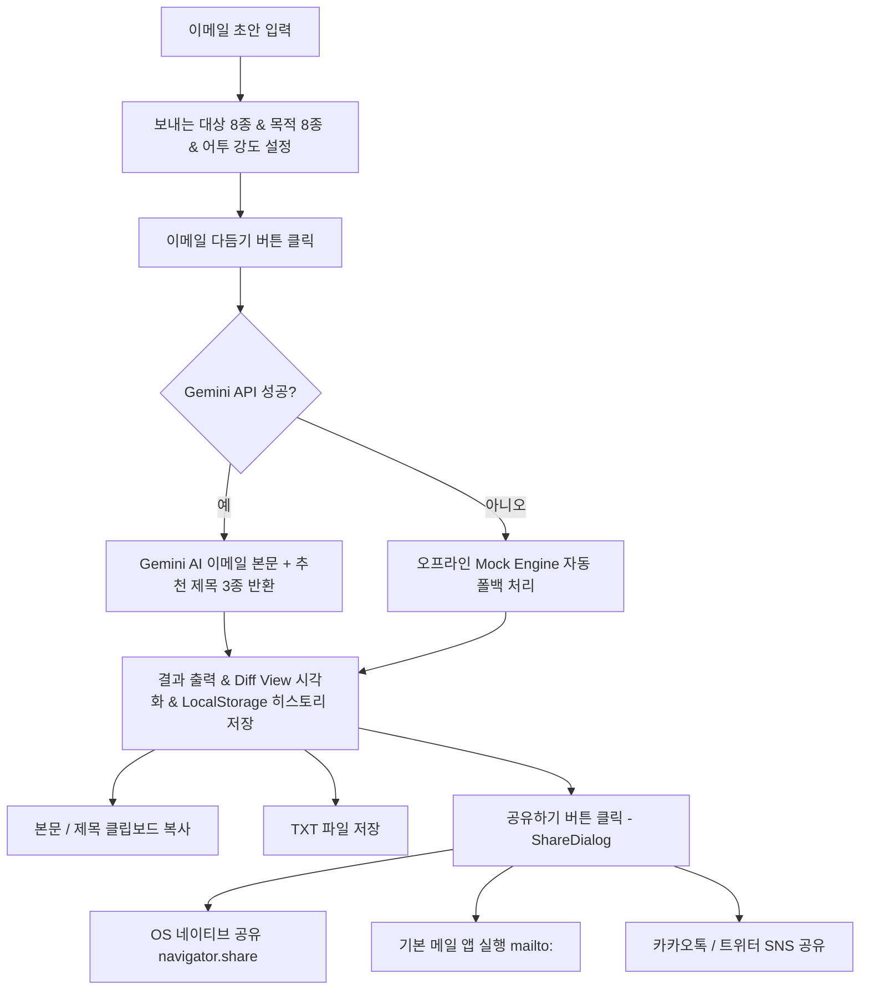

# PRD (Product Requirements Document)

## AI 이메일 말투·문법 다듬기 서비스 (v2.1 - Social & Email Sharing)

---

# 1) 목표와 성공조건

## 목표

사용자가 작성한 이메일 초안을 입력한 뒤 **보내는 대상**, **이메일 목적**, **어투 강도**를 선택하면, **Google Gemini 2.5 AI API**를 통해 정중하고 자연스러운 이메일 본문 및 **추천 이메일 제목 3가지**를 실시간으로 생성하고, 생성된 결과를 **외부 SNS, 메신저 및 기본 이메일 앱(`mailto:`)으로 1클릭 즉시 공유**할 수 있는 웹 애플리케이션입니다.

API 통신 불가 시에도 오프라인 `Mock Engine`으로 자동 폴백하여 끊김 없는 사용자 경험을 보장합니다.

## 성공 조건 (v2.1 기준)

* **Google Gemini AI 연동**: `@google/genai` API를 활용한 컨텍스트 기반 고품질 이메일 리라이팅 제공
* **추천 이메일 제목 3종 제공**: 본문 내용과 상황에 들어맞는 3가지 이메일 제목 자동 추천 및 원클릭 복사
* **외부 SNS 및 이메일 연동 공유 (Social & Email Sharing)**:
  * **Web Share API (`navigator.share`)**: 모바일/데스크톱 OS 네이티브 공유 다이얼로그 연동 (카카오톡, 메시지, 슬랙 등)
  * **이메일 앱 직접 연동 (`mailto:`)**: 클릭 즉시 사용자의 기본 메일 클라이언트(Gmail, Outlook 등)를 열어 제목/본문 즉시 입력
  * **SNS 간편 공유**: 트위터/X (`intent/tweet`) 및 카카오톡 웹 인텐트 공유 지원
* **오프라인 폴백 (Fallback Guarantee)**: API 키 미설정 또는 네트워크 오류 시 오프라인 `mockRewrite` 엔진으로 안전하게 자동 전환
* **원본 vs 다듬은 글 차이 강조 (Diff View)**: 원본 초안과 AI 다듬기 결과를 시각적으로 강조하여 비교
* **최근 다듬기 내역 저장 (History)**: `localStorage` 기반으로 최근 다듬은 내역 5건 저장, 삭제 및 복원 지원
* **생성 결과 저장 유틸리티**: 클립보드 복사 및 이메일 제목 + 본문 포함 `.txt` 파일 다운로드 지원
* **반응형 단일 화면 웹 서비스**: 모바일/데스크톱 환경에 맞춘 UI/UX 및 빠른 응답 속도

---

# 2) 사용자 스토리 & 사용 흐름

---

# 3) 주요 기능 명세

## 기능 1. Google Gemini AI API 연동 (`/api/rewrite`)
* **Endpoint**: `POST /api/rewrite`
* **요청 데이터**: `{ email, recipient, purpose, toneLevel }`
* **응답 데이터**: `{ rewritten, subjectLines: string[], source: 'ai' | 'mock' }`
* **뱃지 표시**: 생성 소스에 따라 `✨ Gemini AI` 또는 `⚡ 오프라인 엔진` 뱃지 시각화

## 기능 2. 추천 이메일 제목 3종 (`SubjectLinesCard`)
* 이메일 본문 내용 및 목적에 어울리는 추천 제목 3개를 상단 카드에 표시
* 각 제목 옆 **제목 복사** 버튼 클릭 시 해당 제목만 클립보드에 복사

## 기능 3. 외부 SNS 및 이메일 공유 (`ShareDialog` & `share-utils.ts`)
* **공유 모달 (ShareDialog)**: 결과 카드 상단 `공유하기` 버튼 클릭 시 팝업 띄움
* **공유 다이얼로그 옵션**:
  1. **OS 네이티브 공유**: `navigator.share()`를 지원하는 디바이스에서 모든 앱으로 공유
  2. **메일 앱으로 보내기**: `mailto:?subject=...&body=...` 생성 후 실행하여 기본 메일 작성창 연결
  3. **트위터 / X 공유**: `https://twitter.com/intent/tweet` 팝업 연동
  4. **카카오톡 공유**: 카카오톡 메시지 및 웹 인텐트 공유 연동
  5. **전체 서식 복사**: 제목과 본문을 한꺼번에 클립보드 복사

## 기능 4. 원문과 비교 View (`Diff View`)
* 원본 초안 카드와 다듬은 글 카드를 나란히 시각화하여 교정 및 수정된 문장을 직관적으로 비교 확인

## 기능 5. 최근 다듬기 내역 (`HistoryCard`)
* 브라우저 `localStorage`를 활용하여 최근 변환한 5건의 이메일 내역 자동 보관
* 내역 삭제, 전체 삭제 및 **이 결과 복원하기** 클릭 시 해당 입력 조건과 결과를 즉시 복원

---

# 4) 기술 스택

* **Framework**: Next.js 16.3.0 (App Router, Turbopack)
* **AI Integration**: Google Gen AI SDK (`@google/genai`, `gemini-2.5-flash`)
* **Library**: React 19, TypeScript 5.7.3
* **Sharing APIs**: Web Share API (`navigator.share`), `mailto:` URI Scheme, Twitter Intent API
* **Styling**: Tailwind CSS v4, Lucide React (Icons)
* **Package Manager**: pnpm v11
